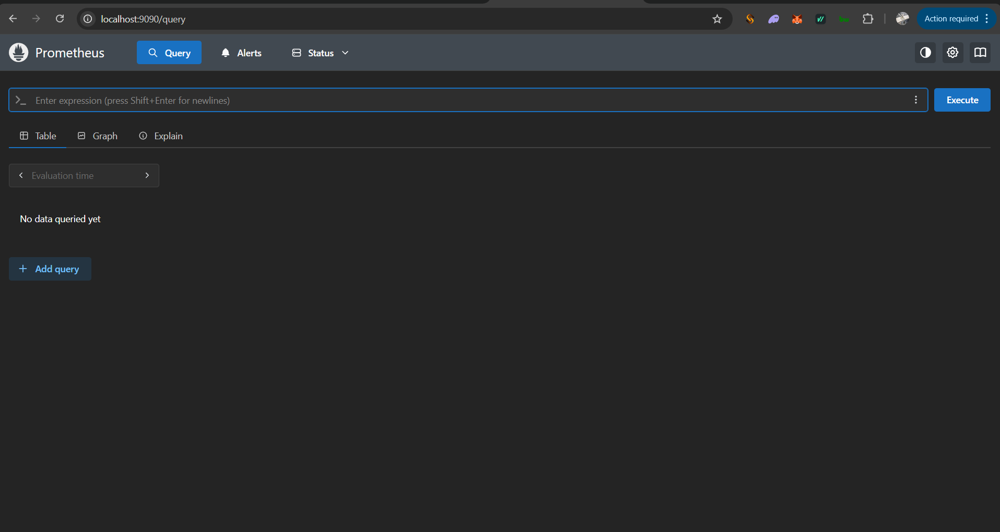
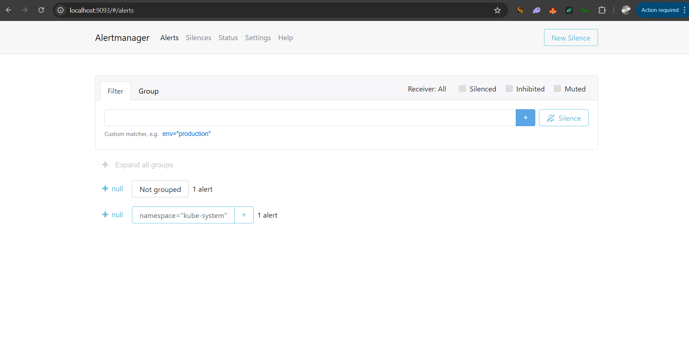
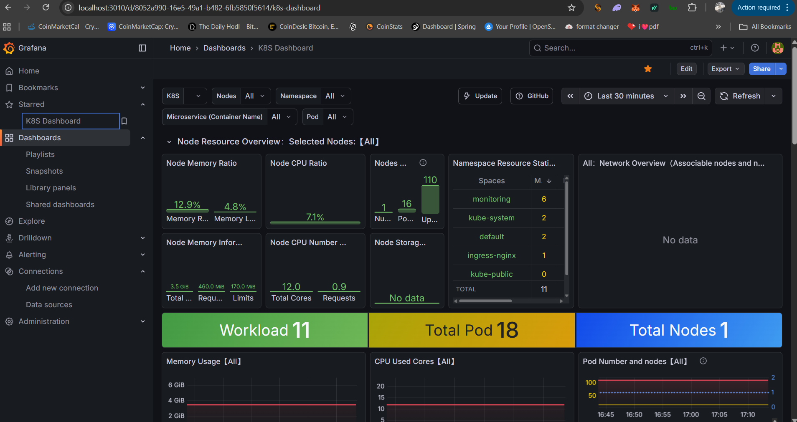
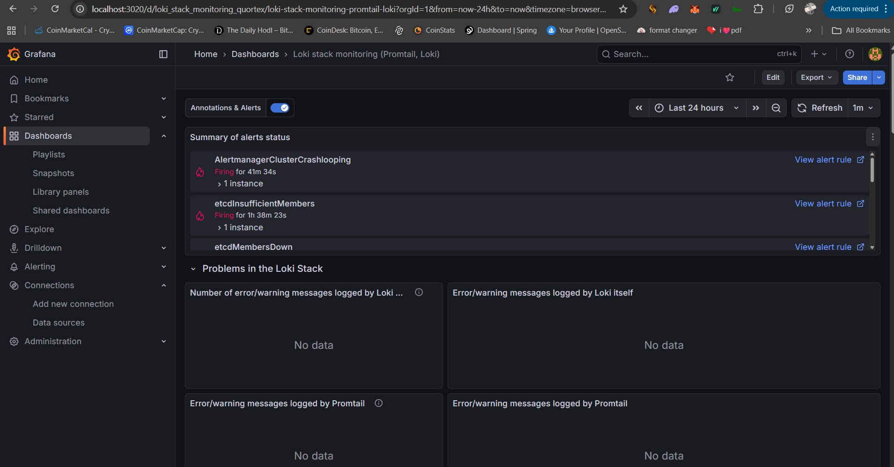
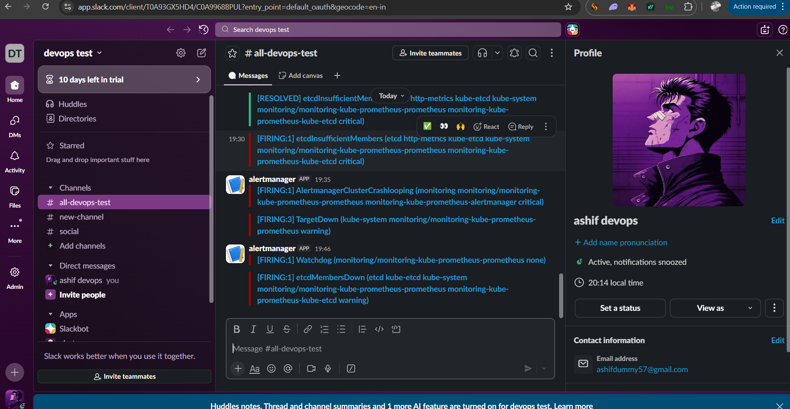
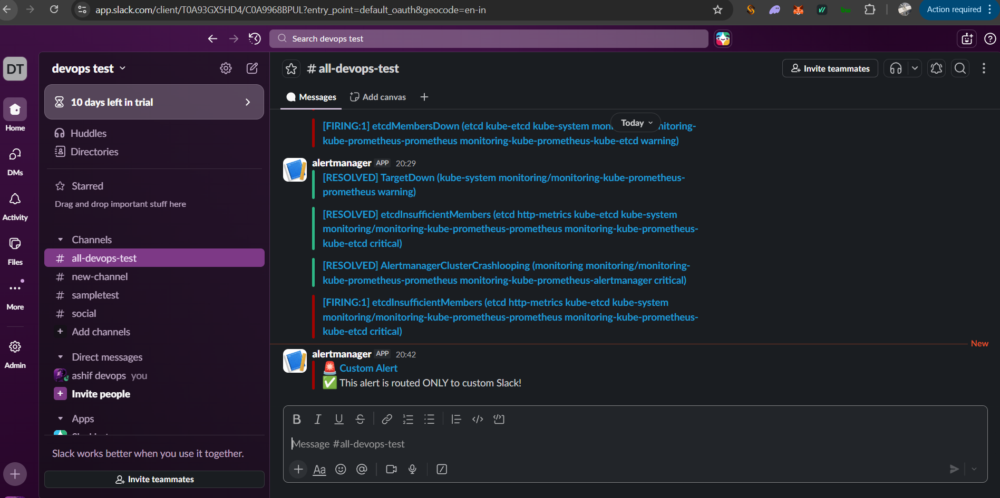
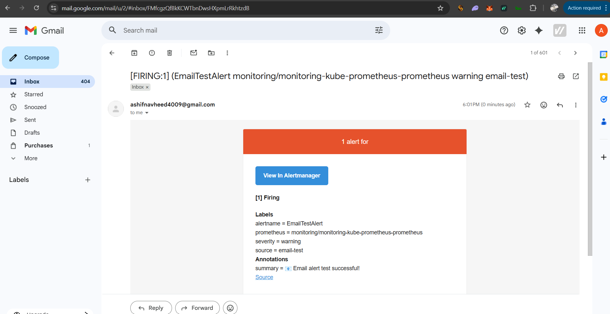

# Prometheus, Loki, and Grafana Monitoring Stack

This project demonstrates a complete monitoring, logging, and alerting stack using **Prometheus**, **Loki**, and **Grafana**. The setup includes successful installation, UI access via port forwarding, custom alerting rules, and notification integration with Slack and Email.

## 🚀 Project Overview

The goal was to implement a robust observability pipeline:

- **Prometheus**: For metrics collection and monitoring.
- **Loki**: For log aggregation.
- **Grafana**: For visualization and dashboards.
- **Alertmanager**: For routing alerts to specific channels (Slack & Email).

## � System Architecture & Alerting Flow

The following diagram illustrates how metrics and logs flow through the system and how alerts are routed to specific channels based on labels.

```mermaid
graph TD
    subgraph "Observability Stack"
        App[Application / System] -->|Metrics| Prom[Prometheus]
        App -->|Logs| Loki[Loki]
        Prom -->|Query| Graf[Grafana]
        Loki -->|Query| Graf
    end

    subgraph "Alerting Pipeline"
        Prom -->|Fires Alert| AM[Alertmanager]

        AM -->|Route: source='custom-test'| Slack[Slack Receiver]
        AM -->|Route: source='email-test'| Email[Email Receiver]

        Slack -->|Notification| SlackCh[#sampletest Channel]
        Email -->|Notification| Gmail[ashifdummy57@gmail.com]
    end

    classDef tool fill:#f9f,stroke:#333,stroke-width:2px;
    classDef dest fill:#bbf,stroke:#333,stroke-width:2px;
    class Prom,Loki,Graf,AM tool;
    class SlackCh,Gmail dest;
```

## �📂 Configuration (`mailconfig`)

The `mailconfig` directory contains the critical configuration files used to set up the alerting logic.

### 1. Alertmanager Configuration (`alert-manager.yaml`)

Configures the routing logic for alerts.

- **Global Config**: Sets up SMTP for sending emails via Gmail.
- **Routes**:
  - Alerts with `source="custom-test"` are routed to **Slack**.
  - Alerts with `source="email-test"` are routed to **Email**.
- **Receivers**:
  - `custom-slack`: Sends notifications to the `#sampletest` Slack channel.
  - `email-alerts`: Sends emails to `ashifdummy57@gmail.com`.

### 2. Prometheus Rules

Custom Prometheus rules were created to test the alerting pipeline.

- **`rules.yaml` (Slack Alert Test)**:
  - **Alert Name**: `CustomSlackOnlyAlert`
  - **Severity**: Critical
  - **Trigger**: `vector(1)` (Always fires for testing)
  - **Annotation**: "✅ This alert is routed ONLY to custom Slack!"

- **`rule2.yml` (Email Alert Test)**:
  - **Alert Name**: `EmailTestAlert`
  - **Severity**: Warning
  - **Trigger**: `vector(1)` (Always fires for testing)
  - **Annotation**: "📧 Email alert test successful!"

## 📸 Screenshots & Verification

The following screenshots demonstrate the successful setup and testing of the monitoring stack.

### Prometheus UI & Alerts

Verification of Prometheus targets and firing alerts.


_Prometheus User Interface_


_Prometheus Alerts Firing_

### Custom Grafana Dashboard

A custom dashboard created to visualize metrics and logs.


_Custom Grafana Dashboard_

### Loki Logs

Log aggregation and querying via Loki.


_Loki Logs Exploration_

### Alert Notifications

Proof of successful alert delivery to configured channels.

#### Slack Alerts

Alerts received in the Slack channel.




#### Email Alerts

Alerts received in the email inbox.


